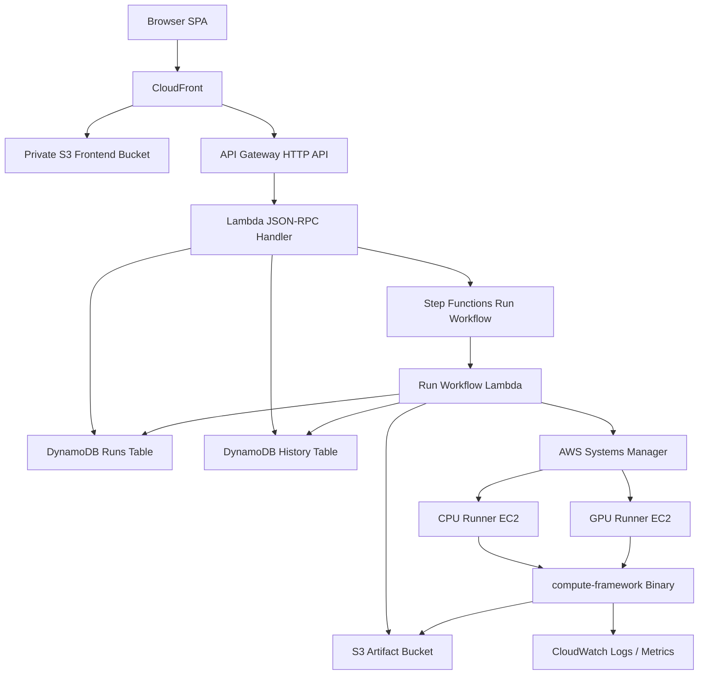
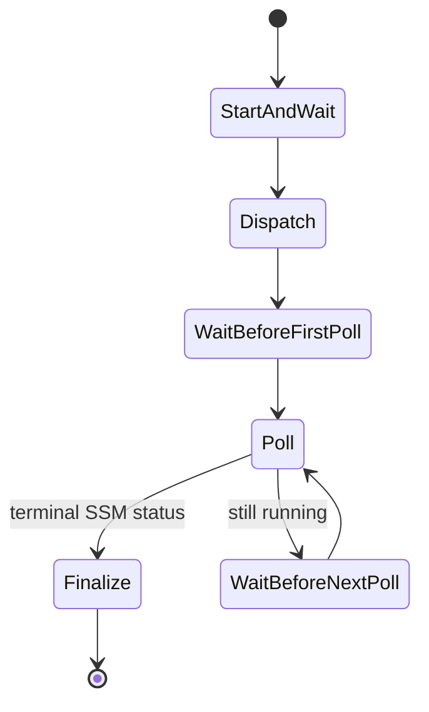

# KernelBench Architecture

KernelBench is a full-stack benchmarking system for comparing CPU and GPU execution across vector operations, matrix multiplication, and convolution. The system is intentionally split into three layers:

- `compute-framework`: the native C++/CUDA benchmark executable
- `infrastructure`: the AWS control plane and runner orchestration
- `frontend`: the React UI for launching, queueing, monitoring, and visualizing runs

The central design principle is separation of concerns. The browser does not know how to execute CUDA kernels. The AWS control plane does not implement matrix multiplication. The native benchmark binary does not know about CloudFront, DynamoDB, or Step Functions.

## High-Level Topology



## Main Components

### Frontend

The frontend is a Vite + React + TypeScript SPA deployed to a private S3 bucket and served through CloudFront.

It provides three main views:

- `Benchmark`: launch CPU/GPU runs, view live runner state, status, progress, and queued runs
- `Performance`: chart historical CPU/GPU operation durations
- `History`: sortable table of completed and failed runs

Important frontend concepts:

- React Query owns API polling and cache invalidation.
- The frontend calls only `POST /api` using JSON-RPC.
- Active and queued runs are restored from backend state after refresh.
- Queued runs can be reordered or deleted from the UI.
- Benchmark metadata is centralized in `frontend/src/benchmarks/benchmarkRegistry.ts`.

### CloudFront

CloudFront fronts both the frontend and the API.

Default behavior:

- serves static SPA assets from the private frontend bucket
- redirects HTTP to HTTPS
- uses SPA fallback responses for direct navigation

API behavior:

- routes `/api` requests to API Gateway
- disables caching for API requests
- injects `x-kernelbench-origin` as a shared secret header

### API Gateway And JSON-RPC Lambda

The backend exposes one JSON-RPC route:

```text
POST /api
```

Current methods:

- `startRun`
- `deleteQueuedRun`
- `reorderQueuedRuns`
- `getRunStatus`
- `listInProgressRuns`
- `getInstanceStates`
- `historyVector`
- `historyMatmul`
- `historyConvolution`
- `runHistory`

The Lambda dispatcher lives in `infrastructure/lambda/rpc_handler.ts`. Method implementations live in `infrastructure/lambda/rpc_methods/`.

The API returns public run views. Internal details such as EC2 instance IDs, SSM command IDs, and S3 prefixes are kept in DynamoDB but are not returned to the frontend.

### DynamoDB Runs Table

The runs table is the live orchestration table.

Primary key:

- `runId`

It stores normal run records and synthetic lock records.

Normal run records include:

- `runId`
- `runner`
- `benchmark`
- `params`
- `status`
- `instanceType`
- `createdAt`
- `queuedAt`
- `dispatchStartedAt`
- `updatedAt`
- `completedAt`
- `startupProgress`
- `progress`
- `performance`
- `reason`
- `error`

Lock records use run IDs like:

```text
RUNNER_LOCK#cpu
RUNNER_LOCK#gpu
```

Those records serialize each runner so only one CPU run and one GPU run can execute at a time.

The table also has a `commandId-index` GSI for SSM command lookup paths.

### DynamoDB History Table

The history table is optimized for chart queries, not orchestration.

Primary key:

- `seriesKey`
- `completedAtRunId`

History records are written only after successful runs with usable performance data. They normalize each benchmark into chart-friendly dimensions:

- vector length and per-operation durations
- matrix dimensions and matrix multiplication duration
- convolution dimensions and convolution duration
- runner
- instance type
- total duration
- completion time

### Step Functions Run Workflow

Step Functions owns the lifecycle of a dispatched run.

The workflow is:



The workflow invokes `infrastructure/lambda/instance_actions/run_workflow_step.ts` with different actions:

- `START_AND_WAIT`: start the EC2 instance if needed and wait for SSM readiness
- `DISPATCH`: send the SSM command to run the benchmark
- `POLL`: poll SSM command status and persist live progress
- `FINALIZE`: attach performance results, write history, release the runner lock, and dispatch next queued work or stop the runner
- `FAIL`: mark the run failed and perform the same cleanup path

The state machine timeout is longer than individual SSM timeouts so large CPU workloads can be represented cleanly.

### Runner Queue

Each runner is treated as a serialized resource:

- CPU queue
- GPU queue

`startRun` creates a run in `QUEUED` status and then asks the queue dispatcher to start the next eligible item. If the runner is already owned by another run, the new run stays queued.

The queue dispatcher:

- finds the oldest queued run for that runner
- claims `RUNNER_LOCK#cpu` or `RUNNER_LOCK#gpu`
- moves the run to `STARTING`
- starts the Step Functions execution

When a run finishes, finalization:

- releases the runner lock
- dispatches the next queued run if one exists
- otherwise acquires a temporary idle-stop lock and stops the instance

That idle-stop lock matters. It prevents an old finalizer from stopping a runner while a newer run is being dispatched.

Queued runs can be deleted or reordered before they start.

### EC2 Runners

KernelBench provisions one CPU runner and one GPU runner.

Defaults:

- CPU: `c7i.8xlarge`
- GPU: `g6e.xlarge`

The CPU runner uses Amazon Linux 2023. The GPU runner uses a CUDA-ready AWS image by default, with `KERNELBENCH_GPU_AMI_ID` / `gpuAmiId` available as an override.

Both runners:

- are created once by CDK
- are stopped by default after stack create/update
- are started only when work is dispatched
- receive work through SSM, not direct HTTP
- write artifacts to S3
- publish metrics/logs to CloudWatch
- keep local build caches under `/opt/kernel-bench/cache`

### Source Bundle And Remote Execution

The source bundle is uploaded to:

```text
s3://<artifact-bucket>/kernel-bench/source/latest.tar.gz
```

The bundle contains:

- source tree
- `.kernel-bench-bundle/manifest.json`
- `sourceHash`
- optional prebuilt CPU/GPU binaries

The runner workflow downloads the source bundle and executes:

```text
infrastructure/scripts/remote_kernel_benchmark.sh
```

The remote script resolves the benchmark binary in this order:

1. use an embedded prebuilt binary if present
2. reuse a cached binary for the same runner and `sourceHash`
3. build `compute-framework` locally on the runner

This keeps normal C++/CUDA changes out of the AMI lifecycle.

### Native Compute Framework

The native binary is the actual benchmark executor.

It supports:

- `--op vector`
- `--op matmul`
- `--op convolution`
- `--backend cpu`
- `--backend gpu`

The benchmark code generates large inputs inside C++ rather than sending giant input arrays through the API. That keeps API payloads small and avoids measuring JSON/base64 transport instead of compute.

The binary emits machine-readable progress and metrics:

- `KERNEL_BENCH_PROGRESS`
- `KERNEL_BENCH_METRICS`

The remote script captures those lines and turns them into DynamoDB progress updates and `performance.json`.

## Run Lifecycle

### 1. Start A Run

The frontend sends:

```json
{
  "jsonrpc": "2.0",
  "method": "startRun",
  "params": {
    "runner": "gpu",
    "benchmark": "matrix-multiplication",
    "params": {
      "inputRows": 1024,
      "inputCols": 1024,
      "outputCols": 1024
    }
  },
  "id": "..."
}
```

The API:

- validates the runner and benchmark
- normalizes integer parameters
- creates an S3 prefix
- writes a `QUEUED` run item
- calls the queue dispatcher
- returns the public run view

### 2. Dispatch Queued Work

If the runner is free, the dispatcher:

- claims the runner lock
- changes the run to `STARTING`
- starts the Step Functions execution

If the runner is busy, the run remains `QUEUED`.

### 3. Start Instance And Wait For SSM

The workflow checks EC2 state and SSM readiness.

It records startup progress such as:

- EC2 state
- EC2 instance status
- EC2 system status
- SSM ping status
- current startup phase

This is what lets the frontend show a meaningful state while the instance is booting.

### 4. Dispatch SSM Command

Once SSM is online, the workflow sends an `AWS-RunShellScript` command.

The command:

- creates a per-run workspace
- downloads the latest source bundle
- extracts it
- runs `remote_kernel_benchmark.sh`
- uploads artifacts to S3

### 5. Poll Until Terminal

Step Functions polls SSM every 15 seconds.

While the command is running, the poll step:

- updates `ssmStatus`
- updates `responseCode`
- reads recent progress from SSM output or CloudWatch logs
- stores latest progress in DynamoDB

### 6. Finalize

When the command reaches a terminal SSM state, finalization:

- maps SSM status to `COMPLETED`, `FAILED`, or `CANCELLED`
- records a reason code
- attaches `performance.json` from S3 when available
- writes history rows for successful runs
- releases the runner lock
- dispatches the next queued run or stops the idle runner

## Status Model

Live statuses:

- `QUEUED`: accepted but not yet dispatched
- `STARTING`: runner lock acquired and workflow starting the instance
- `RUNNING`: SSM command dispatched
- `COMPLETED`: command succeeded
- `FAILED`: command or workflow failed
- `CANCELLED`: command timed out or was cancelled

Failure reasons are part of the data model. Examples include:

- `SSM_COMMAND_FAILED`
- `SSM_COMMAND_TIMED_OUT`
- `PROCESS_KILLED_OOM_OR_SIGNAL`
- `STARTING_STALE_NO_COMMAND`
- `INSTANCE_STOPPING_WHILE_SSM_RUNNING`
- `WORKFLOW_STEP_EXCEPTION`

Reason codes prevent infrastructure failures from being mistaken for compute performance results.

## Timing Model

KernelBench separates operation timing from system timing.

`performance.json` includes:

- `totalDurationMs`
- `phaseDurationsMs.queueStartRequestMs`
- `phaseDurationsMs.instanceBootSsmReadyMs`
- `phaseDurationsMs.buildSetupMs`
- `phaseDurationsMs.gpuWarmupMs`
- `phaseDurationsMs.benchmarkExecutionMs`
- `phaseDurationsMs.uploadFinalizationMs`
- `operationDurations`

The operation durations are the values used for CPU vs GPU comparison. The phase durations explain the product experience around the operation.

### CUDA Warmup

GPU runs perform a tiny CUDA warmup before timed benchmark operations.

The warmup pays first-use CUDA driver/context initialization before the measured operations begin. Without this, the first GPU operation can look artificially slow.

## Artifact Layout

Results are written under the artifact bucket by benchmark, parameters, timestamp, and runner:

```text
kernel-bench/vector/<vector-length>/<timestamp>/<runner>/
kernel-bench/matrix-multiplication/<inputRows-inputCols-outputCols>/<timestamp>/<runner>/
kernel-bench/convolution/<param-key>/<timestamp>/<runner>/
```

Typical artifacts:

- `params.json`
- `metadata.txt`
- `benchmark_metrics.json`
- `performance.json`
- one text output file per operation
- `gpu_warmup.txt` for GPU runs

## Benchmark Registry

KernelBench uses registries to avoid hardcoding benchmark behavior throughout the stack.

Backend registry:

- validates benchmark IDs
- validates and normalizes parameters
- computes S3 parameter keys
- estimates SSM timeout durations

Frontend registry:

- maps benchmark IDs to tabs
- provides display labels
- formats parameters for status cards and queue rows

Adding a benchmark should generally touch:

- compute-framework CLI and CPU/GPU implementations
- backend benchmark registry
- remote runner command construction
- history normalization and chart query
- frontend benchmark registry and form/chart UI

## Security Model

Important boundaries:

- The frontend bucket is private behind CloudFront OAC.
- CloudFront injects `x-kernelbench-origin` when proxying `/api`.
- The JSON-RPC Lambda rejects requests without the expected origin header.
- EC2 runners are controlled through SSM.
- SSH is optional and CIDR-restricted.
- GitHub Actions deploy through an OIDC IAM role.
- API responses use public run views and omit internal instance IDs, SSM command IDs, and S3 prefixes.

The API Gateway CORS setting is permissive, but direct browser access to API Gateway still lacks the CloudFront-injected origin secret. The intended public entrypoint is CloudFront.

## Observability

Observability is split across:

- DynamoDB run state for frontend polling
- CloudWatch logs for SSM command output
- CloudWatch custom metrics for run counts and GPU telemetry
- CloudWatch EC2 metrics for CPU, status checks, memory, and disk
- S3 artifacts for durable benchmark outputs
- DynamoDB history records for chart queries

The frontend polls:

- `getRunStatus` every 2 seconds for active runs
- `listInProgressRuns` every 4 seconds
- `getInstanceStates` every 3 seconds
- `runHistory` every 5 seconds

## Deployment Architecture

GitHub Actions use AWS OIDC.

Workflows:

- `deploy-infrastructure.yml`: builds and deploys CDK, then uploads the latest source bundle
- `deploy-frontend.yml`: builds the SPA, syncs to S3, and invalidates CloudFront
- `build-and-upload-source-bundle.yml`: uploads a fresh source bundle for compute/script-only changes

The current default GPU strategy is to use a CUDA-ready AWS image or an explicit AMI override. Custom AMI bake scripts still exist as operational helpers, but the default deploy workflow no longer bakes a custom GPU AMI.

## Custom Domain

The stack accepts an optional CloudFront domain parameter.

When provided, CDK:

- looks up the Route53 hosted zone by domain name
- creates an ACM certificate with DNS validation
- attaches the certificate and alias to CloudFront
- creates Route53 `A` and `AAAA` alias records

## Cost And Lifecycle Controls

The runners are created stopped by default.

Lifecycle controls:

- stack create/update stops both runners
- a completed run dispatches the next queued run if present
- an idle runner is stopped when its queue is empty
- stale sweep runs every 10 minutes
- stale active runs can be marked failed
- idle instances can be stopped

This balances cost control with warm-runner performance.

## Design Tradeoffs

### Long-Lived Runners Instead Of Per-Run EC2

Pros:

- avoids provisioning an instance from scratch for every benchmark
- enables local build cache reuse
- makes GPU startup costs less punishing across queued runs

Cons:

- requires careful locking
- requires stale-run cleanup
- runner state can leak between runs if cleanup is incomplete

### JSON-RPC Instead Of REST

Pros:

- one CloudFront/API route
- simple method dispatch
- compact frontend client

Cons:

- less self-describing than REST routes
- method names and parameter schemas must be documented carefully

### Source Bundles Instead Of AMI Per Code Change

Pros:

- fast iteration on C++/CUDA code
- avoids Marketplace/AMI churn
- keeps machine environment separate from benchmark source

Cons:

- first run after a source change may need an on-runner rebuild
- source extraction/build errors occur at benchmark time rather than deploy time

## Current Architectural North Star

KernelBench is best thought of as a benchmark job system:

- benchmark definitions are registered
- jobs are queued per runner
- one runner executes one job at a time
- Step Functions orchestrates execution
- SSM runs the native benchmark binary
- S3 stores durable artifacts
- DynamoDB stores live and historical views
- the frontend presents queue state, live progress, and performance analysis

That architecture makes the original CPU vs GPU comparison extensible enough to support future benchmark types.
